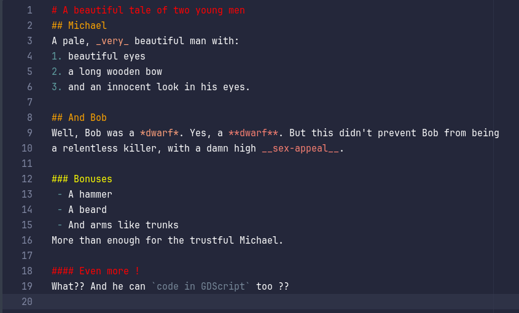
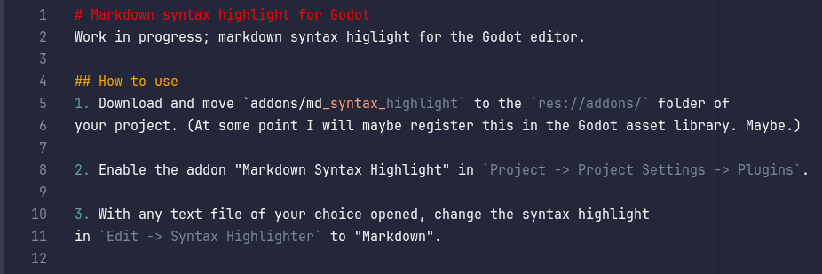

# Markdown syntax highlight for Godot
Work in progress; markdown syntax higlight for the Godot editor.

## How to use
1. Download and move `addons/md_syntax_highlight` to the `res://addons/` folder of
your project. (At some point I will maybe register this in the Godot asset library. Maybe.)

2. Enable the addon "Markdown Syntax Highlight" in `Project -> Project Settings -> Plugins`.

3. With any text file of your choice opened, change the syntax highlight
in `Edit -> Syntax Highlighter` to "Markdown".

## It works!

## ... not always

